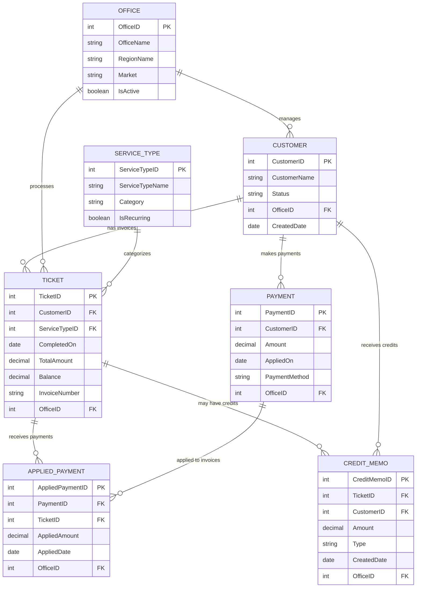

# AR Dashboard Data Model - Accrual-Based Reporting

## Entity Relationship Diagram



## Key Relationships for Accrual-Based Reporting

### 1. **The AppliedPayment "Rosetta Stone"**
- **Central Link**: AppliedPayment connects Payments to Tickets (Invoices)
- **Many-to-Many**: One payment can be applied to multiple invoices, and one invoice can receive multiple payments
- **Partial Payments**: AppliedAmount allows for partial payment tracking

### 2. **Customer → Ticket (Invoice) → Payment Flow**
```
Customer (1) → (N) Ticket [Invoiced Revenue]
    ↓                 ↓
    ↓                 ← AppliedPayment [Links Collections to Invoices]
    ↓                 ↑
    └→ (N) Payment [Collected Revenue]
```

### 3. **AR Aging Calculation Path**
```
Ticket.CompletedOn → Days Since Invoice → Age Bucket
Ticket.Balance → Outstanding Amount per Invoice
Sum(Ticket.Balance) by Customer → Customer AR Balance
```

### 4. **Revenue Recognition Flow**
- **Invoiced Revenue**: Sum of Ticket.TotalAmount (when CompletedOn is set)
- **Collected Revenue**: Sum of AppliedPayment.AppliedAmount
- **AR Balance**: Invoiced Revenue - Collected Revenue

## Power BI Model Best Practices

### 1. **Star Schema Design**
- **Fact Tables**: Ticket, Payment, AppliedPayment, CreditMemo
- **Dimension Tables**: Customer, Office, ServiceType
- **Date Dimension**: Create from Ticket.CompletedOn and Payment.AppliedOn

### 2. **Relationships in Power BI**
```
DimDate[Date] → Ticket[CompletedOn] (1:N)
DimDate[Date] → Payment[AppliedOn] (1:N)
Customer[CustomerID] → Ticket[CustomerID] (1:N)
Customer[CustomerID] → Payment[CustomerID] (1:N)
Ticket[TicketID] → AppliedPayment[TicketID] (1:N)
Payment[PaymentID] → AppliedPayment[PaymentID] (1:N)
Office[OfficeID] → Customer[OfficeID] (1:N)
ServiceType[ServiceTypeID] → Ticket[ServiceTypeID] (1:N)
```

### 3. **Bidirectional Filtering**
- Enable between AppliedPayment ↔ Ticket for payment allocation analysis
- Enable between AppliedPayment ↔ Payment for cash application tracking

### 4. **Role-Playing Dimensions**
Create multiple date relationships:
- InvoiceDate: DimDate → Ticket[CompletedOn]
- PaymentDate: DimDate → Payment[AppliedOn]
- AppliedDate: DimDate → AppliedPayment[AppliedDate]

## Key Metrics Calculation Logic

### DSO (Days Sales Outstanding)
```
DSO = Average AR Balance / (Total Revenue / Days in Period)
Where:
- Average AR Balance = Average of daily AR balances
- Total Revenue = Sum of Ticket.TotalAmount in period
```

### CEI (Collection Efficiency Index)
```
CEI = (Collections in Period) / (Beginning AR + Sales - Ending Current AR) × 100
Where:
- Collections = Sum of AppliedPayment.AppliedAmount
- Sales = Sum of Ticket.TotalAmount
- Current AR = Tickets with Balance > 0 and Age ≤ 30 days
```

### AR Aging Buckets
```
0-30 Days: Tickets where DATEDIFF(TODAY, CompletedOn) ≤ 30
31-60 Days: Tickets where DATEDIFF(TODAY, CompletedOn) BETWEEN 31 AND 60
61-90 Days: Tickets where DATEDIFF(TODAY, CompletedOn) BETWEEN 61 AND 90
Over 90 Days: Tickets where DATEDIFF(TODAY, CompletedOn) > 90
```

## Performance Optimization Tips

1. **Create Aggregated Tables**
   - Daily AR snapshots for trending
   - Pre-calculated aging buckets
   - Customer balance summaries

2. **Index Key Fields**
   - CustomerID, TicketID, PaymentID
   - Date fields (CompletedOn, AppliedOn)
   - OfficeID for filtering

3. **Incremental Refresh**
   - Configure for Ticket and Payment tables
   - Keep 2 years of history
   - Daily refresh for recent data

## Integration Architecture

```
FieldRoutes API
    ↓
Prefect ETL Pipeline
    ↓
Snowflake (Raw → Staging → Views)
    ↓
Power BI Service (Dataset)
    ↓
Power BI Reports/Dashboards
```